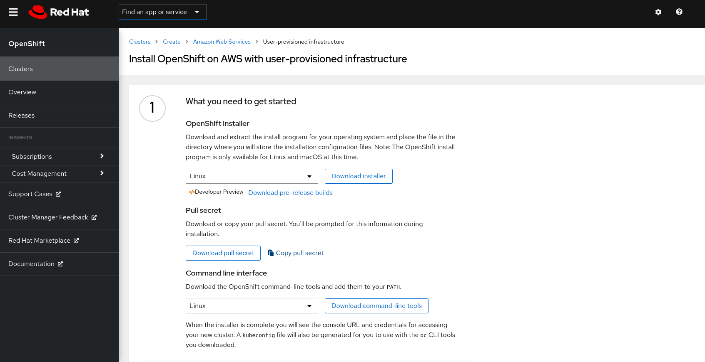
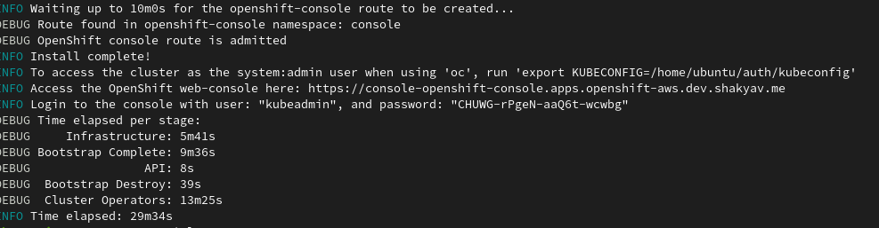
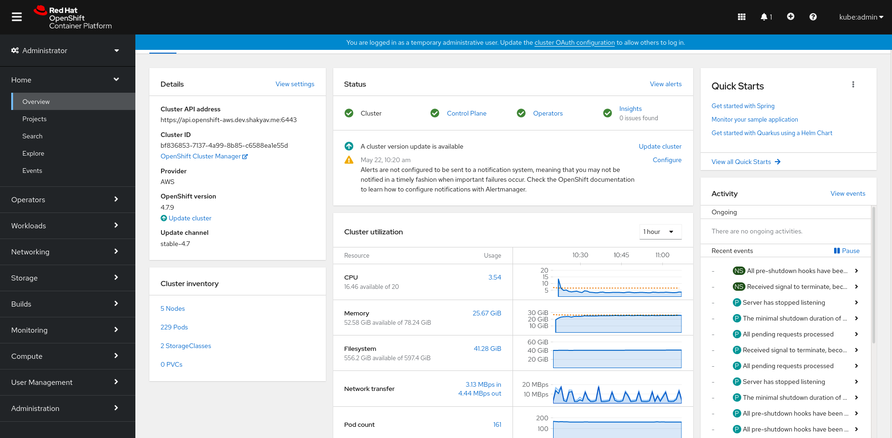
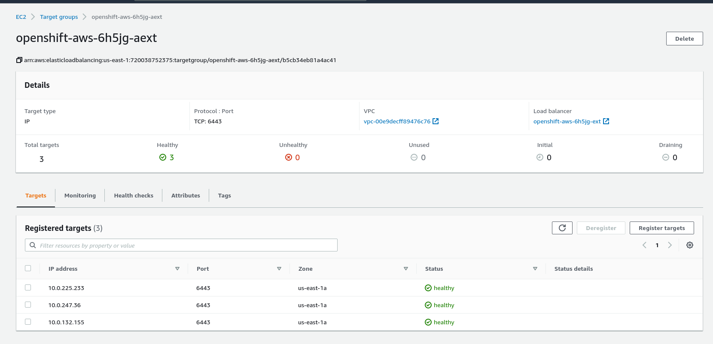

# openshit.4.x_install_aws

# Prerequisites
  1. setup the aws cli and configure aws account and set access key and secret key for the aws cli
  2. Buy a free domain name, can also buy the paid , as per your needs
  3. setup a public hosted zone with aws route53 , and copy paste the name servers provided by the 
     route53 records to the nameservers section for your purchased domain name

# Step 1 - Download the installer
   - download the installer from red hat openshift cluster manager(https://cloud.redhat.com/openshift/)
   - if you don't have a acount then register first
   - once you log in , go to the cluster -> create cluster -> Run it yourself -> AWS -> User provisioned infrastructure
   - download the installer for your OS

# Step 2 - extract the downloaded files
   - extract the installer file , in my case I used "tar -xvzf <installer_filename>" command to extract files
   - after extraction use "ls" command to list the extracted files , you can see the "openshift-install" file
   - copy the "openshift-install" to "/usr/local/bin" directory , command "cp openshift-install /usr/local/bin"

# Step 3 - create install-config
   - execute the command "openshift-install create install-config" on the terminal
   - 1st thing it will ask is for the platform , select aws and hit enter
   - 2nd parameter it ask for is the region, I selected us-east-1
   - 3rd parameter is the base domain , in my case I already have bought a domain name and setup the route53 
     hosted zone and also edited the name servers for my domain
   - 4th  parameter is the Cluster name, can give any name of your choice , I used, openshift-aws
   - 5th parameter is the pull secret, go back to the location from where you downloaded the openshift-installer
     and copy the pull secret form there and hit enter
   - now do an ls to list the files, you can see the install-config.yaml file

# Step 4 - edit the install-config
   - open the install-config.yaml in vi editor to edit, and copy paste the install-config.yaml provided in the repository
   - the file in the repository doesn't have the pull-secret but when you go through the step3 your own pull-secret will be populated in the
     install-config.yaml file
   - also past your own sshkey at the end of the file as well
   - verify your install-config file with the install-config provided in the repository, and make sure they are almost same 
     except the pull-secret and ssh key
   - also you can change the type of ec2 instances , I used m4.xlarge which offers 4vCPUs and 16 GB RAM, you can also specify 
     the iops and storage size as per your need

# Step 5 - create the cluster
   - After editing the install-config, make a copy of the install-config becaue if will be consumed while creating the cluster, 
     hence you cant't resue it if you only have one copy
   - execute "openshift-install create cluster --log-level=debug" to install the cluster , it take 20-45 mins, it varies based on the
     type of instance , sometimes it can fail if it can't pul some images (this gnerally happens if the instances you are running are
     less than minimum config)
   - once the installer is finished successfully , it will return the web-console url and kubeadmin user and password as the output
   - all if due to some reasons your terminal freeze up and you can't view whether the installer has finished or not, do an "ls"
     to verify the directories 'auth', 'tls' and file 'metadata.json' is created or not
   - the format of the console url is like this https://console-openshift-console.apps.cluster-name.base-domain , 
     cluster-name and base domain are same as you provided while creating the install-config.yaml
   - "kubeadmin" is the default admin user and you find the password for it in ./auth/kubeadmin-password file
   - login to the web-console with "kubeadmin" user and password

# verify the installation
   - go to ec2 on your aws web console and navigate to the target groups, check all the targets are healthy or not, 
     installation will not finish properly even if 1 traget is unhealthy
   - when you start the installer it creates a bootstrap instance which terminates once everythin all the targets are helathy and ready
   - verify that the all the master node instances are running
   - also verify the worker instances are running and healthy after bootstrap finishes

# installer success screen

# Post Login screen

# target health check

Will update the repo soon with post installation steps and configuring IDPs and creating accounts , projects and other taks.